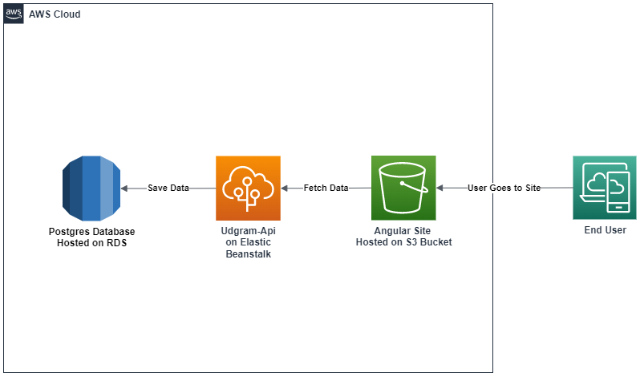

# App Infrastructure

## Used Services:
 -  S3 For static hosting frontend service http://mo-bucket-udagram.s3-website-us-east-1.amazonaws.com/
 -  Elastic Beanstalk for deploying backend server http://udagram-api-dev.eba-yrstdxyh.us-east-1.elasticbeanstalk.com
 -  RDS for hosting PostgresSQl server

