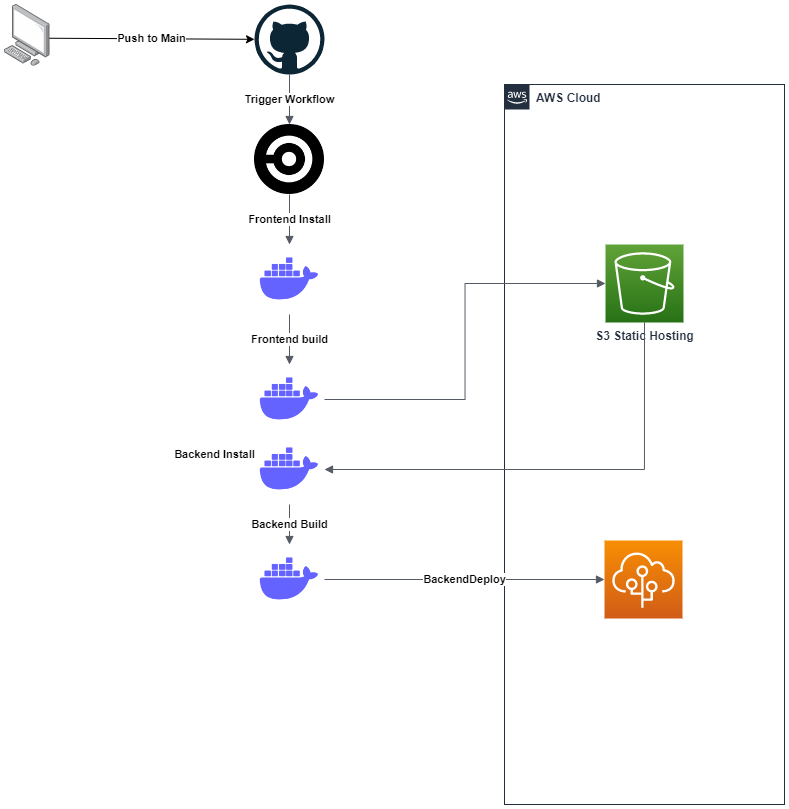

# Pipeline documentation

- we use CircleCi as our pipeline the config file found at *.circleci/config.yml*

## The config file has the following flows

- Frontend
    - Install
    - Build
    - Deploy
- Backend
    - Install
    - Build
    - Limit to master entry point (work around for deployment issues)
    - Install aws beanstalk for circleci
    - Deploy
